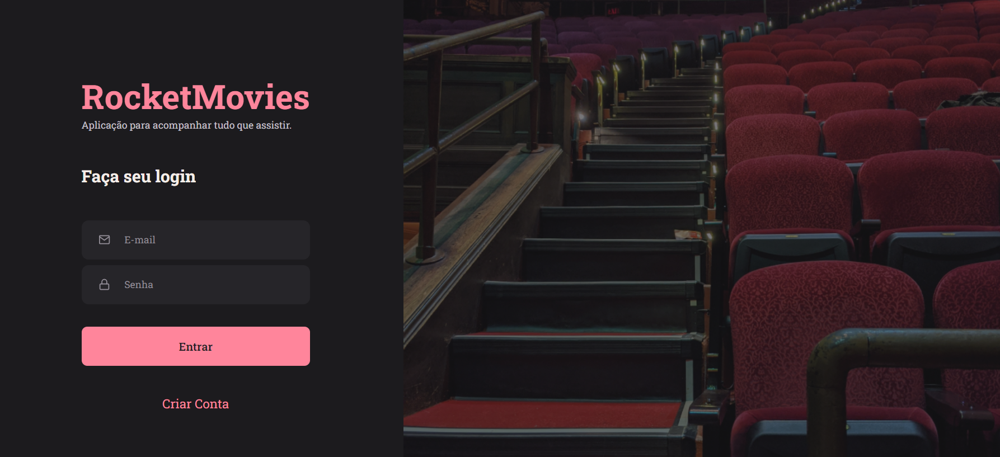

# Rocket Movies 🎬

O projeto Rocket Movies foi desenvolvido para que possamos adicionar notas sobre nossos filmes favoritos. Nessas notas, podemos inserir Titulo do filme, a sua classificação, qual o tipo de filme (Terror, Ficção...) e ainda colocar suas observações.

## Features ✔️
- [x] Cadastro de usuário
- [x] Autenticação do usuário
- [x] Atualização de informações do Usuário
- [x] Upload de Fotos
- [x] Pesquisa dinâmica pelo titulo da nota
- [x] Cadastro da nota com classificação, categorias, titulo e opniões
- [x] Responsividade

## Stacks Utilizadas ⚙️
- React
- Styled Components
- Axios
- Cors
- JavasSript
- NodeJs
- Vite

## Apresentação 🎨

 

    <b>Clique na imagem para usar a aplicação</b> 
     
  

  
## Back-end 🖥️
Veja o backend da aplicação: <a href="https://github.com/chrishenderson07/Rocket-Movies-API">Veja aqui</a> 

## Autor 
 
Feito com ❤️ por Christopher Henderson 👋🏽 Entre em contato!

 

